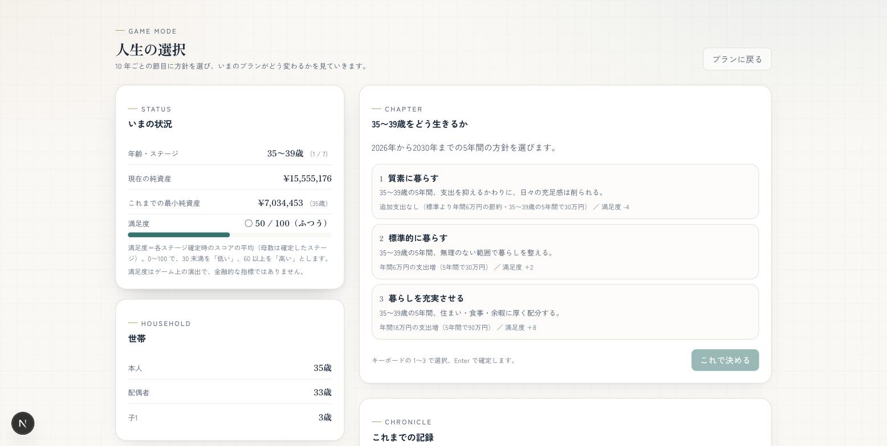
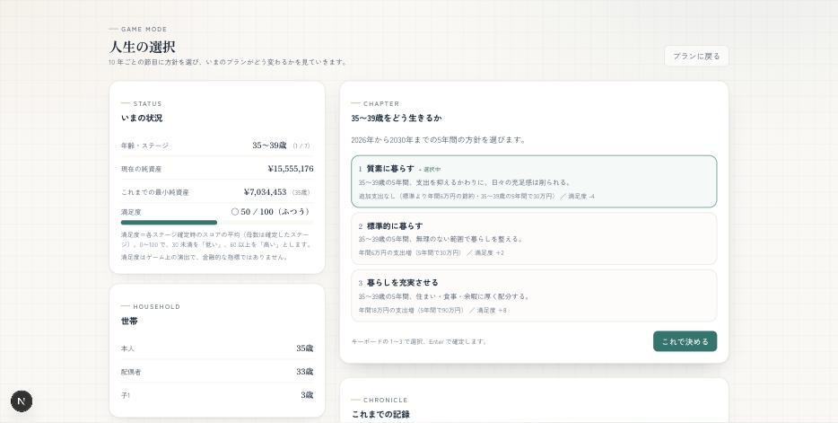
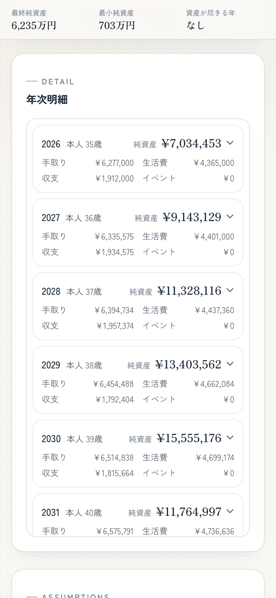
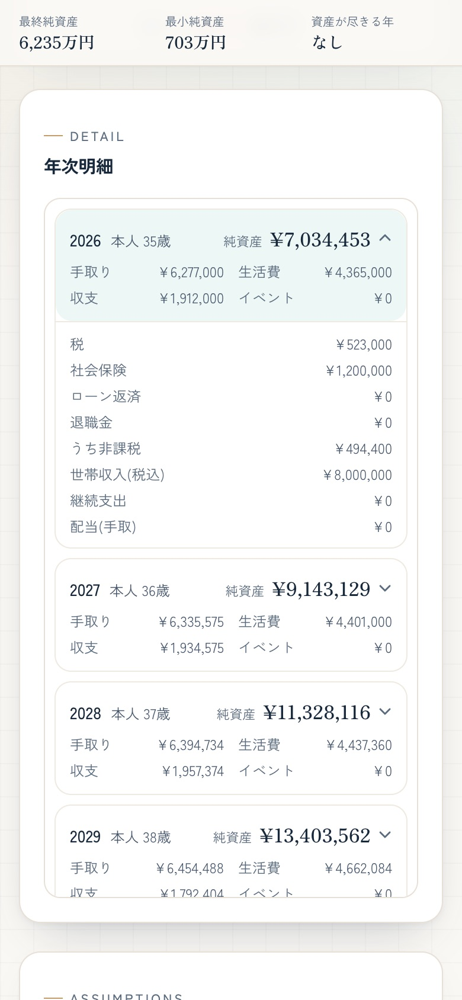
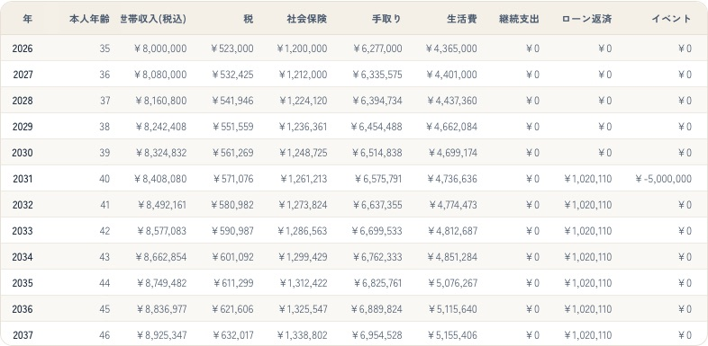
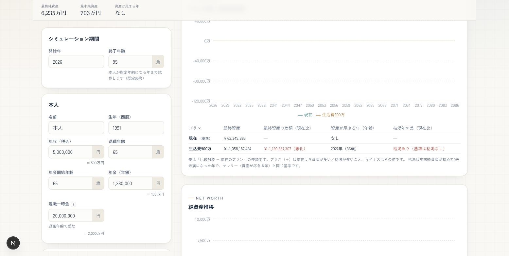
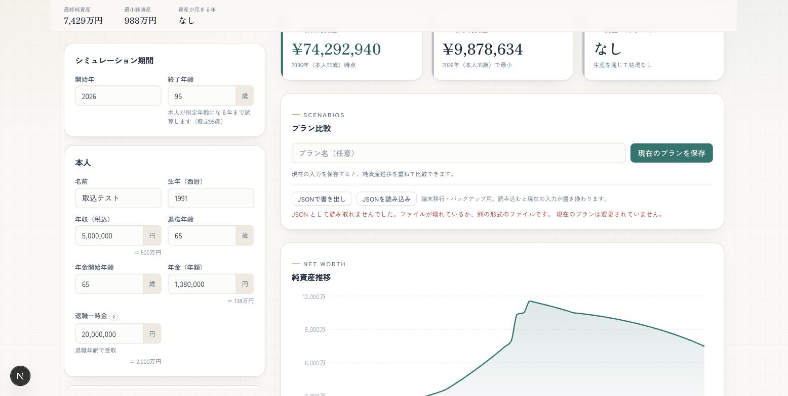

# life-plan

生涯のライフプランを計画・シミュレーションできる Web アプリ。

世帯（本人・配偶者・子）の収入・支出・ライフイベント・資産運用条件をもとに、
現在から将来までの年次キャッシュフローと純資産推移を計算し、グラフ・表で可視化する。

## 想定スタック

- Next.js (App Router) + TypeScript
- Tailwind CSS / Recharts / Zustand / React Hook Form + zod
- データ保存: ブラウザ内 localStorage（サーバー不要）

## 機能

- 収支キャッシュフローの年次シミュレーション（純関数エンジン `src/features/simulation/domain/engine.ts`）
- ライフイベント（単発の臨時収支）の反映
- **住宅ローン・借入**（元利均等返済を返済期間中だけ支出計上）
- **教育費の精緻化**（子ごとに幼稚園〜大学の進路＝公立/私立/国公立/私立文系・理系を選択。基礎養育費＋進路別の教育費を年齢に応じて自動計算。プリセットあり）
- **NISA/iDeCo・退職金**（課税口座と非課税口座の2分割。課税口座の運用益に約20%課税、非課税口座は運用益非課税。年間積立を非課税口座へ。退職一時金は退職年に退職所得課税の概算後で受取）
- 資産運用・インフレを考慮した資産推移
- 公的年金・所得税/住民税・社会保険料の **簡易な概算**
- **複数シナリオ比較**（現在の入力を名前付きスナップショットとして保存し、純資産推移を重ね描き／読込・削除）
- 入力・スナップショットは localStorage に自動保存
- 純資産推移・年次キャッシュフローのグラフと年次明細テーブル

> 税・年金・社会保険料・教育費・退職所得課税などは厳密な制度計算ではなく、大まかな概算です。

## スクリーンショット（ゲームモード）

| 初期状態（未選択・確定ボタン無効） | カード選択中（プレビューのみ） | 結果 |
|---|---|---|
|  |  |  |

## スクリーンショット（年次明細テーブル）

640px 未満は 1年=1カードのコンパクト表示（タップで税・社会保険などを展開）、640px 以上は従来の横スクロールテーブル。

| モバイル 390px（折りたたみ） | モバイル 390px（展開） | デスクトップ |
|---|---|---|
|  |  |  |

## スクリーンショット（比較の差分数値表）

スナップショットを保存すると、比較グラフの下に最終資産・枯渇年（年齢）と「現在のプラン」との差額を表で表示します（差は「比較対象 − 現在」、プラスが改善）。枯渇なしは「なし」、片方のみ枯渇のときは文言で示します。



## プランの JSON 書き出し/読み込み

「プラン比較」パネルから、現在の入力を JSON ファイルで書き出し・読み込みできます（端末移行・バックアップ用、標準 API のみ）。ファイルは `{ format, version, input }` 形式で、読み込み時に検証し、旧形式（v1）は既存の移行を通します。不正なファイルは日本語エラーを表示し、現在のプランは変更されません。



## セットアップ

```bash
npm install
npm run dev    # http://localhost:3000
npm run build  # 本番ビルド（型チェック・Lint 込み）
npm run test   # シミュレーションエンジンの単体テスト（Vitest）
```

## 構成

- `src/app/` — App Router のページ・レイアウト（`/` と `/game`）
- `src/features/plan/` — 入力（`PlanInput`）のドメイン・編集ユースケース・検証・永続化・入力フォーム
- `src/features/simulation/` — シミュレーションエンジン・税/年金/社保等の制度計算・結果表示（グラフ・テーブル）
- `src/features/scenario/` — スナップショットの保存・比較と比較 UI
- `src/features/game/` — ゲームモード
- `src/shared/` — 書式・用語集などの汎用関数と共通 UI 部品
- 各機能は `domain`・`application`・`infrastructure`・`ui` の層に分かれ、import の境界は `src/architecture.test.ts` が検証する
