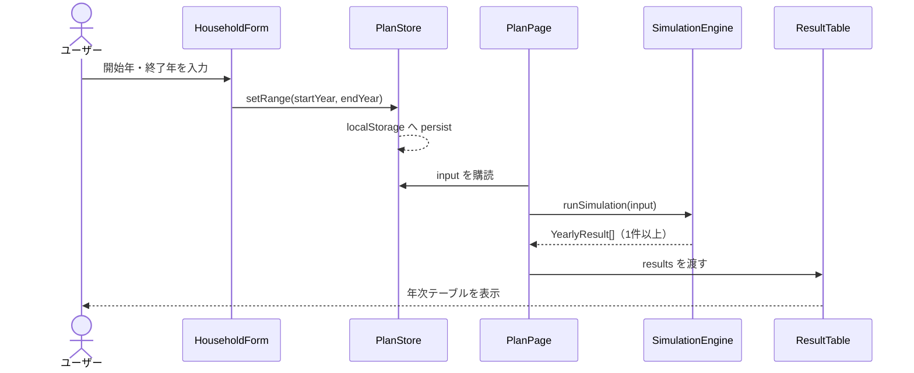

# アーキテクチャ分析（life-plan）

## System Overview

`life-plan` は Next.js（App Router）による単一ページのクライアントサイド
Web アプリケーション。サーバーサイドAPIは持たず、すべてのドメインロジックは
ブラウザ内で完結する純粋関数として実装されている。状態は Zustand ストアが
一元管理し、`persist` ミドルウェアで `localStorage` に永続化される。詳細な
コンポーネント一覧は `component-inventory.md` を参照。

## Architectural Style

**モノリシック・クライアントサイド SPA**（レイヤードアーキテクチャ）。

根拠:
- サーバーサイド API ルート（`src/app/api/`）が存在しない（developer-scan.md
  「APIs Discovered」参照、詳細は `api-documentation.md`）。
- 単一 npm パッケージ・単一リポジトリで、サブパッケージ分割やマイクロサービス
  分割はない（developer-scan.md「Packages Found」参照）。
- `team.md` Code Style に明記された
  `components → store → lib/simulation・lib/game → lib/schema` の単方向レイヤー
  依存が、今回のスキャン範囲で一貫して守られている。

## Component Relationships

```mermaid
graph TD
    subgraph UI["UI 層 (src/app, src/components)"]
        PlanPage["PlanPage<br/>src/app/page.tsx"]
        GamePage["GamePage<br/>src/app/game/page.tsx"]
        HouseholdForm["HouseholdForm"]
        LoanForm["LoanForm"]
        OtherForms["ExpenseForm / AssetForm / EventForm"]
        FormFields["FormFields<br/>(NumberField, error prop)"]
        ResultTable["ResultTable"]
        Charts["charts/*<br/>(NetWorthChart 等)"]
        GameHud["GameHud"]
        GameUI["AdventureLog / GameResult / StageCard"]
    end

    subgraph Store["状態管理層 (src/lib/store)"]
        PlanStore["PlanStore<br/>(usePlanStore, Zustand + persist)"]
        NewLoanFactory["NewLoanFactory"]
    end

    subgraph Domain["ドメインロジック層 (src/lib/simulation, src/lib/game)"]
        SimulationEngine["SimulationEngine<br/>runSimulation()"]
        SimulationTypes["SimulationTypes<br/>PlanInput / YearlyResult"]
        GameStages["GameStages"]
        GameAdvance["GameAdvance"]
        GameEvents["GameEvents"]
    end

    subgraph Persistence["永続化・検証層 (src/lib/schema.ts)"]
        PersistenceSchema["PersistenceSchema<br/>planInputSchema (zod)"]
    end

    HouseholdForm --> FormFields
    LoanForm --> FormFields
    OtherForms --> FormFields
    HouseholdForm --> PlanStore
    LoanForm --> PlanStore
    LoanForm --> NewLoanFactory
    PlanPage --> PlanStore
    PlanPage --> SimulationEngine
    PlanPage --> ResultTable
    PlanPage --> Charts
    GamePage --> PlanStore
    GamePage --> GameStages
    GamePage --> GameHud
    GamePage --> GameUI
    GameStages --> GameAdvance
    GameStages --> GameEvents
    GameStages --> SimulationTypes
    SimulationEngine --> SimulationTypes
    PlanStore --> PersistenceSchema
    PlanStore --> SimulationTypes

    style SimulationEngine fill:#f66,stroke:#900,stroke-width:2px
    style PersistenceSchema fill:#f66,stroke:#900,stroke-width:2px
    style HouseholdForm fill:#f66,stroke:#900,stroke-width:2px
```



テキストフォールバック: UI層（PlanPage/GamePage 配下の各フォーム・表示
コンポーネント）→ 状態管理層（PlanStore）→ ドメインロジック層
（SimulationEngine, GameStages 等）→ 永続化・検証層（PersistenceSchema）の
単方向依存。赤枠3コンポーネント（SimulationEngine, PersistenceSchema,
HouseholdForm）が issue #14 の技術的根本原因に直接関与する（詳細は
`code-quality-assessment.md` の Technical Debt Signals）。

## Interaction Diagrams

シミュレーション実行という中核ビジネストランザクションが、正常系と
issue #14 の不具合系でどうコンポーネント間に実装されているかを示す。

### 正常系: ユーザーがシミュレーション期間を入力し結果を得る



### 不具合系: 開始年 > 終了年（issue #14）

```mermaid
sequenceDiagram
    actor User as ユーザー
    participant Form as HouseholdForm
    participant Store as PlanStore
    participant Page as PlanPage
    participant Engine as SimulationEngine
    participant Table as ResultTable

    User->>Form: 開始年 > 終了年 を入力
    Form->>Store: setRange(startYear, endYear)
    Note over Form: NumberField の error prop は<br/>未接続のため警告なし
    Store-->>Store: 検証なしで persist
    Page->>Store: input を購読
    Page->>Engine: runSimulation(input)
    Note over Engine: for (year=startYear; year<=endYear; year++)<br/>が0回実行 → 例外なし
    Engine-->>Page: results = []（空配列）
    Page->>Table: results=[] を渡す
    Table-->>User: 空の <tbody>（無言）
    Note over User: エラー表示が一切ないため<br/>原因に気づけない
```

このシーケンスの3箇所（Form→Store の未検証、Engine のループ条件、
Page/Table の空配列描画）が根本原因の全体であり、詳細な行番号は
`code-quality-assessment.md` の Technical Debt Signals に一本化して記録する。

## Data Flow

1. ユーザー入力（フォーム）→ `PlanStore`（Zustand action）
2. `PlanStore` は状態変更のたびに `persist` ミドルウェア経由で `localStorage`
   に書き込む。読み込み時は `PersistenceSchema` の `safeParse` で検証し、
   失敗時は既定値へフォールバックする（`project.md` Mandated 規約に整合）。
3. `PlanPage` / `GamePage` は `PlanStore` の状態（`PlanInput`）を購読し、
   `SimulationEngine.runSimulation` または `GameStages` の生成ロジックに渡す。
4. 計算結果（`YearlyResult[]` またはステージ配列）は `ResultTable` / 各チャート
   / `GameHud` 等の表示コンポーネントに props として渡され、DOM に描画される。
5. サーバーとの通信は一切なく、全データフローはブラウザ内で完結する。

## Key Design Decisions

- **例外を使わない異常系表現**（`project.md` Mandated）: zod の `safeParse` と
  `null` 許容型の戻り値パターンを徹底しており、`try`/`catch` は使用されない。
  この方針は issue #14 の修正設計にも直接影響する（`error` prop や `safeParse`
  ベースの検証で解決すべきという制約になる）。
- **完全クライアントサイド永続化**: サーバー無し・`localStorage` のみという
  構成により、可用性・スケーラビリティ上の懸念は小さいが、複数デバイス間
  同期や共有機能は原理的に持てない。
- **フォームの `error` prop 機構が実装済みだが未接続**: `FormFields`
  （`fields.tsx`）にはアクセシブルな検証エラー表示の仕組みが既に存在するが、
  `HouseholdForm` の開始年・終了年フィールドではまだ利用されていない
  （`code-quality-assessment.md` 参照）。

## Improvement Opportunities

- `PersistenceSchema`（`planInputSchema`）に `startYear <= endYear` の相互検証
  （`.refine`）を追加し、`HouseholdForm` の `error` prop 機構に接続することで、
  例外を使わずにissue #14 を解消できる（`code-quality-assessment.md` に詳細）。
- `SimulationEngine.runSimulation` および `GameStages` のループ条件が
  同一の前提（`startYear <= endYear`）に依存しているため、修正時は両方への
  影響を確認する必要がある。
- カバレッジ計測ツール（`@vitest/coverage-v8` 等）が未導入で、`team.md` の
  80% 目標を客観的に検証できない（`code-quality-assessment.md` 参照）。
