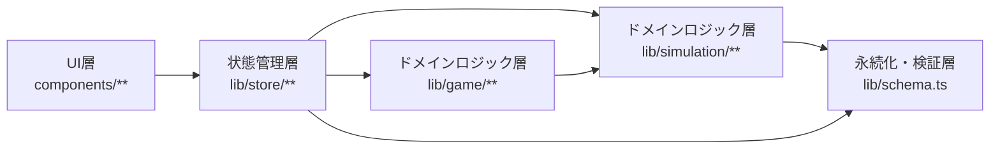

# 依存関係（life-plan）

## 外部依存関係

パッケージ名・バージョン・用途の一覧は `technology-stack.md` に一本化して
記録する（本ファイルでは重複記載しない）。ここでは依存の「関係性」のみを
扱う。

- 実行時依存はすべて npm レジストリ経由（プライベートレジストリやモノレポ内
  ワークスペース参照は無し、単一パッケージ構成）。
- サーバーサイドの外部サービス依存（DB、外部API、認証プロバイダ等）は無し
  — 完全クライアントサイドアプリのため（`api-documentation.md` 参照）。

## 内部レイヤー依存グラフ

`team.md` Code Style で定義された単方向依存を、今回のスキャンで確認した
実際のインポート関係として記録する（コンポーネント単位の責務は
`component-inventory.md` を参照）。

- **UI → Store**: フォームコンポーネント（`HouseholdForm`, `LoanForm` 等）が
  `usePlanStore` のアクションを呼び出す。
- **Store → Simulation/Game**: `usePlanStore` は `PlanInput`（`simulation/types.ts`
  由来の型）を状態として保持し、`newLoan.ts` は `simulation/types.ts` の型を
  参照する。
- **Simulation/Store → Schema**: `usePlanStore` の永続化復元処理と
  シミュレーション入力の検証が `schema.ts` の zod スキーマに依存する。
- **Game → Simulation**: `lib/game/project.ts` が `SimulationEngine` を呼び出す
  （人生ゲームの資産投影計算）。
- **逆方向依存（`lib` → `components`）**: 今回のスキャン範囲では検出されず、
  規約は遵守されている。

## Issue #14 に関わる依存の連鎖

`HouseholdForm`（UI）→ `PlanStore.setRange`（状態管理、検証なし）→
`SimulationEngine.runSimulation` / `GameStages`（ドメインロジック、検証前提の
ループ）→ `ResultTable` 等（UI、空結果を無言描画）という一連の依存チェーンが、
検証責務をどのレイヤーも負っていないために不具合を生んでいる。根本原因の
詳細な行番号は `code-quality-assessment.md` に一本化して記録する。
